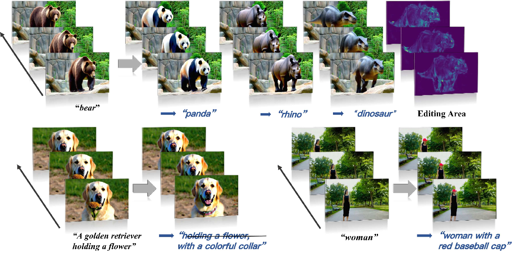

<p align="center">

  <h1 align="center">FlowDirector: Training-Free Flow Steering for Precise Text-to-Video Editing</h1>
  <p align="center">
    <a href="https://guangzhaoli.github.io/"><strong>Guangzhao Li</strong></a>
    ·
    <a href="https://ycgu.site/"><strong>Yanming Yang</strong></a>
    ·
    <a href="https://zhangjiewu.github.io/"><strong>Chenxi Song</strong></a>
    ·
    <a href="https://junhaozhang98.github.io//"><strong>Chi Zhang</strong></a>    <br>
    <br>
        <a href="https://arxiv.org/abs/2310.08465"></a>
        <a href='https://showlab.github.io/MotionDirector'></a>
        <a href='https://huggingface.co/spaces/ruizhaocv/MotionDirector'></a>
  </p>

<p align="center">
  
  <br>
  <em>FlowDirector edits videos based on text prompts, preserving unedited regions and maintaining temporal coherence.</em>
</p>


---

## 🌟 Key Features

*   🌊 **Inversion-Free Editing:** Directly evolves video in data space, bypassing noisy and error-prone inversion processes.
*   ⚙️ **ODE-Driven Transformation:** Smoothly transitions videos along their spatiotemporal manifold, preserving coherence and structural details.
*   🎨 **Spatially Attentive Flow Correction (SAFC):** An attention-guided masking mechanism precisely modulates the ODE velocity field, ensuring unedited regions remain unchanged both spatially and temporally.
*   🎯 **Differential Averaging Guidance (DAG):** A CFG-inspired strategy that leverages differential signals between multiple candidate flows to enhance semantic alignment with target prompts without compromising structural consistency.
*   🏆 **State-of-the-Art Performance:** Outperforms existing methods in instruction adherence, temporal consistency, and background preservation.

---

## 🔥 News

*   [Date] - News item 1...
*   [Date] - News item 2...

---

## 📑 ToDo

*   [ ] Task 1
*   [ ] Task 2

---

## 🚀 Getting Started

### Pre-trained Models

Download the **Wan2.1-T2V-1.3B** model checkpoints from their official sources (e.g., from the <a href="https://github.com/Wan-Video/Wan2.1">Wan2.1 GitHub</a> or <a href="https://huggingface.co/Wan-AI/Wan2.1-T2V-1.3B">Hugging Face</a>). You will need to provide the path to the directory containing these checkpoints using the `--ckpt_dir` argument when running the editing script (see examples below).

For instance, if you download them to `/root/autodl-tmp/Wan2.1-T2V-1.3B`, you will use `--ckpt_dir /root/autodl-tmp/Wan2.1-T2V-1.3B`.


### Installation

1.  Clone the repository (replace `YOUR_USERNAME` with the actual path if forked, or use the main repo URL):
    ```bash
    git clone https://github.com/YOUR_USERNAME/FlowDirector.git
    cd FlowDirector
    ```
2.  Install dependencies:
    ```bash
    pip install -r requirements.txt
    ```

---

## ⚙️ How to Use

You can edit a video using the `edit.py` script. Ensure you have a source video, corresponding source/target text prompts, and have downloaded the pre-trained models.

### Single-GPU Editing

Here's an example of how to run video editing on a single GPU:

```bash
bash script_edit_single_gpu.sh
```


### Multi-GPU Editing (using `torchrun`)

For multi-GPU editing (e.g., 4 GPUs):

```bash
bash script_edit_multi_gpu.sh
```

For detailed parameter explanations, please refer to the `edit.py` file.

---

## 🎬 FlowDirector Editing Demos

FlowDirector achieves superior results across various editing tasks. Below are specific demonstrations:

---
#### Original Subject: Large Brown Bear

<table style="width:100%;">
  <thead>
    <tr>
      <td style="text-align:center;" width="33%">Original Video (Source Keyword)</th>
      <td style="text-align:center;" width="33%">Edited Video 1 (Target Keyword)</th>
      <td style="text-align:center;" width="33%">Edited Video 2 (Target Keyword)</th>
    </tr>
  </thead>
  <tbody>
    <tr>
      <td style="text-align:center;"></td>
      <td style="text-align:center;"></td>
      <td style="text-align:center;"></td>
    </tr>
    <tr>
      <td style="text-align:center;" width="33%">large brown bear</td>
      <td style="text-align:center;" width="33%">large panda</td>
      <td style="text-align:center;" width="33%">large dinosaur</td>
    </tr>
  </tbody>
</table>

---
#### Original Subject: Rabbit

<table style="width:100%;">
  <thead>
    <tr>
      <td width="33%" style="text-align:center;">Original Video (Source Keyword)</th>
      <td width="33%" style="text-align:center;">Edited Video 1 (Target Keyword)</th>
      <td width="33%" style="text-align:center;">Edited Video 2 (Target Keyword)</th>
    </tr>
  </thead>
  <tbody>
    <tr>
      <td style="text-align:center;"></td>
      <td style="text-align:center;"></td>
      <td style="text-align:center;"></td>
    </tr>
    <tr>
      <td style="text-align:center;">rabbit</td>
      <td style="text-align:center;">Crochet rabbit</td>
      <td style="text-align:center;">Origami rabbit</td>
    </tr>
  </tbody>
</table>

---
#### Original Subject: Black Swan

<table style="width:100%;">
  <thead>
    <tr>
      <td style="text-align:center;" width="33%">Original Video (Source Keyword)</th>
      <td style="text-align:center;" width="33%">Edited Video 1 (Target Keyword)</th>
      <td style="text-align:center;" width="33%">Edited Video 2 (Target Keyword)</th>
    </tr>
  </thead>
  <tbody>
    <tr>
      <td style="text-align:center;"></td>
      <td style="text-align:center;"></td>
      <td style="text-align:center;"></td>
    </tr>
    <tr>
      <td style="text-align:center;">black swan</td>
      <td style="text-align:center;">pink flamingo</td>
      <td style="text-align:center;">white duck</td>
    </tr>
  </tbody>
</table>

---
#### Original Subject: Woman in a black dress

<table style="width:100%;">
  <thead>
    <tr>
      <td style="text-align:center;" width="33%">Original Video (Source Keyword)</th>
      <td style="text-align:center;" width="33%">Edited Video 1 (Target Keyword)</th>
      <td style="text-align:center;" width="33%">Edited Video 2 (Target Keyword)</th>
    </tr>
  </thead>
  <tbody>
    <tr>
      <td style="text-align:center;"></td>
      <td style="text-align:center;"></td>
      <td style="text-align:center;"></td>
    </tr>
    <tr>
      <td style="text-align:center;">woman in a black dress</td>
      <td style="text-align:center;">a red baseball cap</td>
      <td style="text-align:center;">woman in a blue shirt and jeans</td>
    </tr>
  </tbody>
</table>

---
#### Original Subject: Silver Jeep

<table style="width:100%;">
  <thead>
    <tr>
      <td style="text-align:center;" width="33%">Original Video (Source Keyword)</th>
      <td style="text-align:center;" width="33%">Edited Video 1 (Target Keyword)</th>
      <td style="text-align:center;" width="33%">Edited Video 2 (Target Keyword)</th>
    </tr>
  </thead>
  <tbody>
    <tr>
      <td style="text-align:center;"></td>
      <td style="text-align:center;"></td>
      <td style="text-align:center;"></td>
    </tr>
    <tr>
      <td style="text-align:center;">silver jeep</td>
      <td style="text-align:center;">Porsche car</td>
      <td style="text-align:center;">Tractor</td>
    </tr>
  </tbody>
</table>

---
#### Original Subject: Holding a flower

<table style="width:100%;">
  <thead>
    <tr>
      <td style="text-align:center;" width="33%">Original Video (Source Keyword)</th>
      <td style="text-align:center;" width="33%">Edited Video 1 (Target Keyword)</th>
      <td style="text-align:center;" width="33%">Edited Video 2 (Target Keyword)</th>
    </tr>
  </thead>
  <tbody>
    <tr>
      <td style="text-align:center;"></td>
      <td style="text-align:center;"></td>
      <td style="text-align:center;"></td>
    </tr>
    <tr>
      <td style="text-align:center;">holding a flower</td>
      <td style="text-align:center;"><del>holding a flower</del></td>
      <td style="text-align:center;">A golden retriever with a colorful collar</td>
    </tr>
  </tbody>
</table>

---
#### Original Subject: Cats

<table style="width:100%;">
  <thead>
    <tr>
      <td style="text-align:center;" width="33%">Original Video (Source Keyword)</th>
      <td style="text-align:center;" width="33%">Edited Video 1 (Target Keyword)</th>
      <td style="text-align:center;" width="33%">Edited Video 2 (Target Keyword)</th>
    </tr>
  </thead>
  <tbody>
    <tr>
      <td style="text-align:center;"></td>
      <td style="text-align:center;"></td>
      <td style="text-align:center;"></td>
    </tr>
    <tr>
      <td style="text-align:center;">cats</td>
      <td style="text-align:center;">dogs</td>
      <td style="text-align:center;">kangaroo</td>
    </tr>
  </tbody>
</table>

---
#### Original Subject: Wolf

<table style="width:100%;">
  <thead>
    <tr>
      <td style="text-align:center;" width="33%">Original Video (Source Keyword)</th>
      <td style="text-align:center;" width="33%">Edited Video 1 (Target Keyword)</th>
      <td style="text-align:center;" width="33%">Edited Video 2 (Target Keyword)</th>
    </tr>
  </thead>
  <tbody>
    <tr>
      <td style="text-align:center;"></td>
      <td style="text-align:center;"></td>
      <td style="text-align:center;"></td>
    </tr>
    <tr>
      <td style="text-align:center;">wolf</td>
      <td style="text-align:center;">fox</td>
      <td style="text-align:center;">husky</td>
    </tr>
  </tbody>
</table>

---
#### Original Subject: Sea Turtle

<table style="width:100%;">
  <thead>
    <tr>
      <td style="text-align:center;" width="33%">Original Video (Source Keyword)</th>
      <td style="text-align:center;" width="33%">Edited Video 1 (Target Keyword)</th>
      <td style="text-align:center;" width="33%">Edited Video 2 (Target Keyword)</th>
    </tr>
  </thead>
  <tbody>
    <tr>
      <td style="text-align:center;"></td>
      <td style="text-align:center;"></td>
      <td style="text-align:center;"></td>
    </tr>
    <tr>
      <td style="text-align:center;">sea turtle</td>
      <td style="text-align:center;">dolphin</td>
      <td style="text-align:center;">seal</td>
    </tr>
  </tbody>
</table>

---
#### Original Subject: Sea Lion

<table style="width:100%;">
  <thead>
    <tr>
      <td style="text-align:center;" width="33%">Original Video (Source Keyword)</th>
      <td style="text-align:center;" width="33%">Edited Video 1 (Target Keyword)</th>
      <td style="text-align:center;" width="33%">Edited Video 2 (Target Keyword)</th>
    </tr>
  </thead>
  <tbody>
    <tr>
      <td style="text-align:center;"></td>
      <td style="text-align:center;"></td>
      <td style="text-align:center;"></td>
    </tr>
    <tr>
      <td style="text-align:center;">sea lion</td>
      <td style="text-align:center;">Seahorse</td>
      <td style="text-align:center;">Clownfish</td>
    </tr>
  </tbody>
</table>

---
#### Original Subject: Woman (Gym)

<table style="width:100%;">
  <thead>
    <tr>
      <td style="text-align:center;" width="33%">Original Video (Source Keyword)</th>
      <td style="text-align:center;" width="33%">Edited Video 1 (Target Keyword)</th>
      <td style="text-align:center;" width="33%">Edited Video 2 (Target Keyword)</th>
    </tr>
  </thead>
  <tbody>
    <tr>
      <td style="text-align:center;"></td>
      <td style="text-align:center;"></td>
      <td style="text-align:center;"></td>
    </tr>
    <tr>
      <td style="text-align:center;">woman</td>
      <td style="text-align:center;">chimpanzee</td>
      <td style="text-align:center;">Spider-Man</td>
    </tr>
  </tbody>
</table>

---
#### Original Subject: Red Cockatiel

<table style="width:100%;">
  <thead>
    <tr>
      <td style="text-align:center;" width="33%">Original Video (Source Keyword)</th>
      <td style="text-align:center;" width="33%">Edited Video 1 (Target Keyword)</th>
      <td style="text-align:center;" width="33%">Edited Video 2 (Target Keyword)</th>
    </tr>
  </thead>
  <tbody>
    <tr>
      <td style="text-align:center;"></td>
      <td style="text-align:center;"></td>
      <td style="text-align:center;"></td>
    </tr>
    <tr>
      <td style="text-align:center;">red cockatiel</td>
      <td style="text-align:center;">blue budgie</td>
      <td style="text-align:center;">eagle</td>
    </tr>
  </tbody>
</table>

---
#### Original Subject: Puppy

<table style="width:100%;">
  <thead>
    <tr>
      <td style="text-align:center;" width="33%">Original Video (Source Keyword)</th>
      <td style="text-align:center;" width="33%">Edited Video 1 (Target Keyword)</th>
      <td style="text-align:center;" width="33%">Edited Video 2 (Target Keyword)</th>
    </tr>
  </thead>
  <tbody>
    <tr>
      <td style="text-align:center;"></td>
      <td style="text-align:center;"></td>
      <td style="text-align:center;"></td>
    </tr>
    <tr>
      <td style="text-align:center;">puppy</td>
      <td style="text-align:center;">chinchilla</td>
      <td style="text-align:center;">cat</td>
    </tr>
  </tbody>
</table>


---


## 📜 Citation

If you find FlowDirector useful for your research, please cite our paper:

```bibtex
@inproceedings{Li2023FlowDirector,
  title     = {FlowDirector: Training-Free Flow Steering for Precise Text-to-Video Editing},
  author    = {Guangzhao Li and Yanming Yang and Chenxi Song and Chi Zhang},
  booktitle = {Conference on Neural Information Processing Systems (NeurIPS)},
  year      = {2023},
  url       = {https://arxiv.org/abs/2310.08465}
}
```

---


## 📝 License

This project is licensed under the MIT License - see the [LICENSE](LICENSE) file for details.

---

## 📧 Contact

For questions or inquiries, please contact Guangzhao Li at [gzhao.cs@gmail.com] or open an issue in this repository.